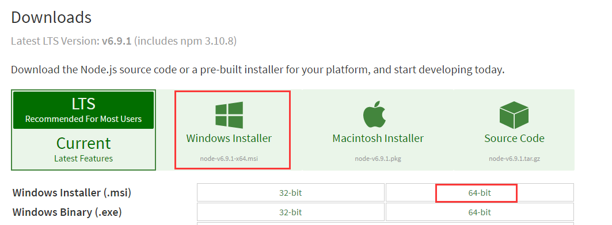
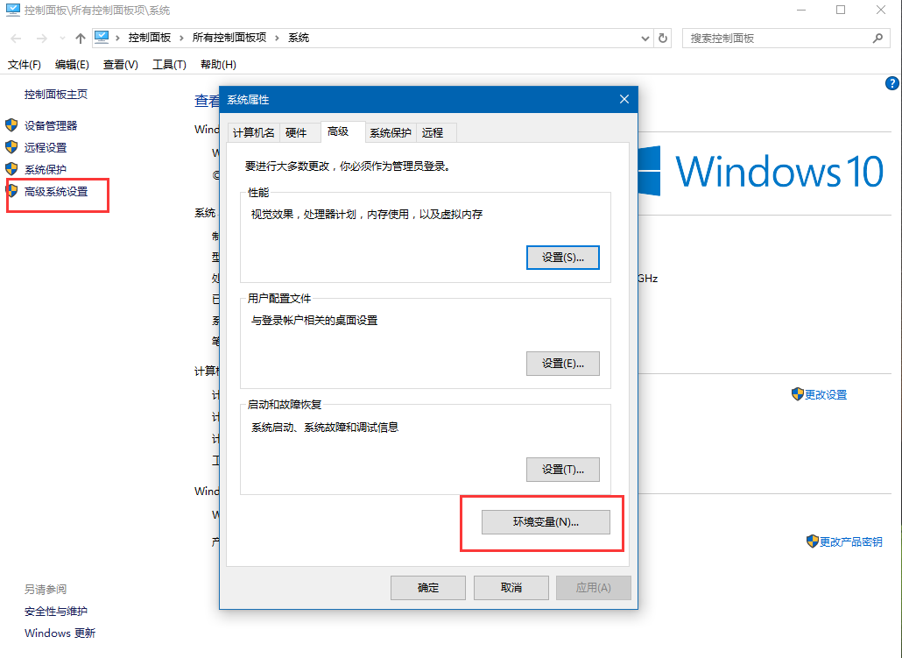
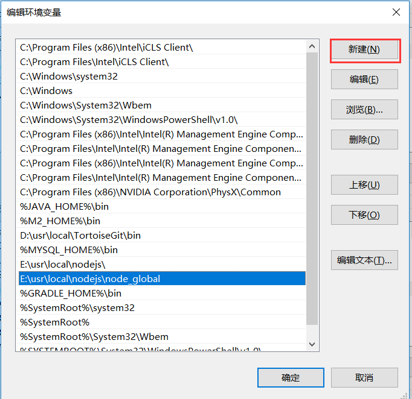
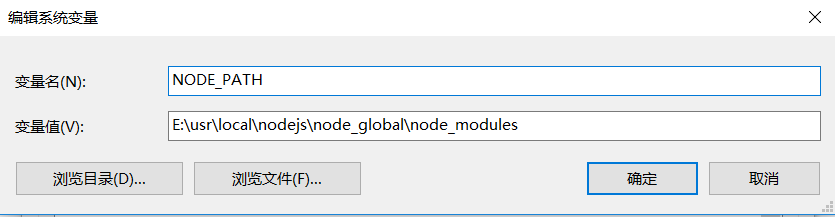
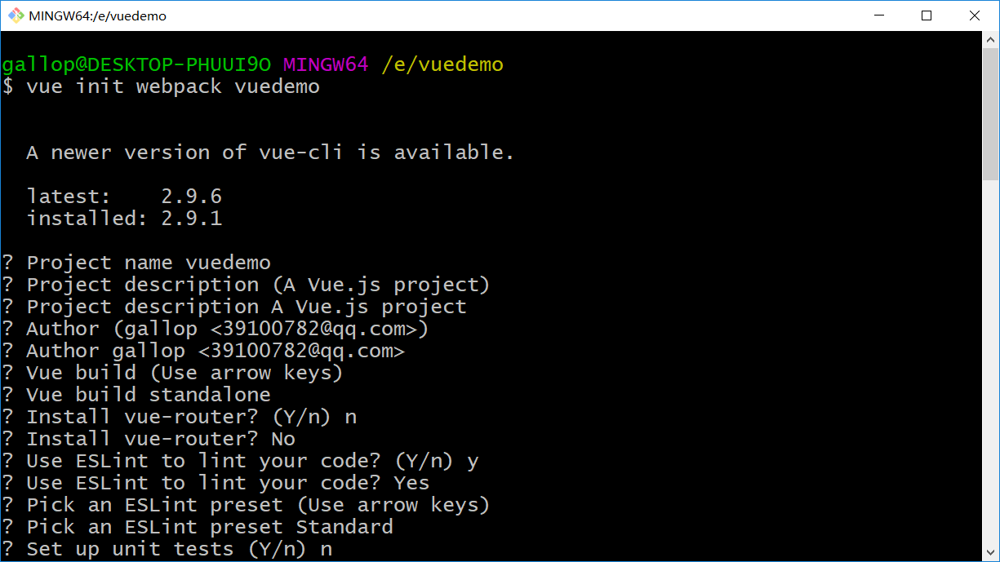
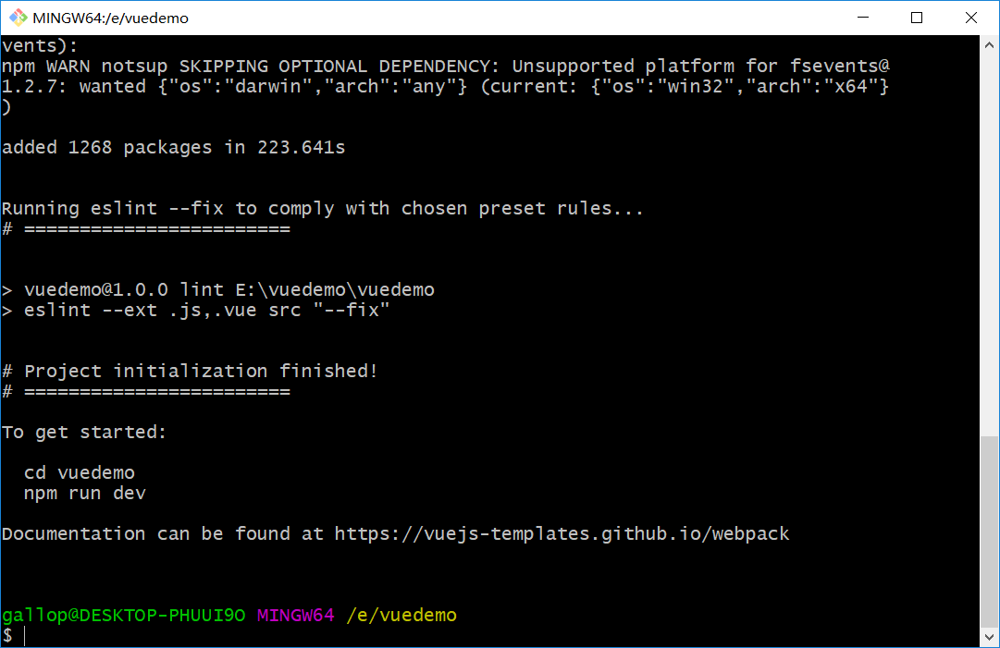
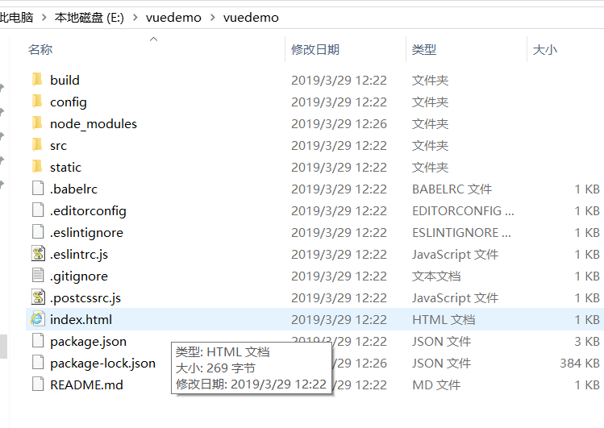

# vue脚手架安装环境

## 详细的安装步骤如下：

### 一、安装node.js

>说明：安装node.js的windows版本后，会自动安装好node以及包管理工具npm，我们后续的安装将依赖npm工具。

- node.js下载
  - 下载地址: <https://nodejs.org/en/download/> 如下图：


    根据自己电脑的具体配置，选择你要下载的安装包，作者选择的是windows 64bit。
    下载完毕，按照windows一般应用程序，一路next就可以安装成功，建议不要安装
    在系统盘（如C：）。

### 二、设置global和cache路径

>说明：设置路径能够把通过npm安装的模块集中在一起，便于管理。

1.在nodejs的安装目录下，新建node_global和node_cache两个文件夹，作者的安装目录为“E:\usr\local\nodejs\”
2.设置global和cache,命令如下：
```
npm config set prefix "E:\usr\local\nodejs\node_global
npm config set cache "E:\usr\local\nodejs\node_cache
```
    设置成功后，后续用命令npm install XXX -g安装以后模块就在
    E:\usr\local\nodejs\node_global\node_modules里

### 三、安装cnpm

>说明：由于许多npm包都是在国外，我们这里用到淘宝的镜像服务器，来对我们依赖的module进行安装，因此首先安装“中国的npm”——cnpm

参考网址如下：<http://npm.taobao.org/>

安装命令为：
`npm install -g cnpm --registry=https://registry.npm.taobao.org`

### 四、设置环境变量（非常重要）

>说明：设置环境变量可以使得住任意目录下都可以使用cnpm、vue等命令，而不需要输入全路径

1、鼠标右键"此电脑"，选择“属性”菜单，在弹出的“系统”对话框中左侧选择“高级系统设置”，弹出“系统属性”对话框。如下图：


2、点击环境变量弹出下列对话框：


3、选中PATH，点击编辑，然后点击新增把“E:\usr\local\nodejs\node_global”加到path变量中。


4、新增系统变量NODE_PATH：
   &nbsp;&nbsp;&nbsp;&nbsp;在下面的系统变量中点击新建，弹出下框，把变量值设置成“E:\usr\local\nodejs\node_global\node_modules”


>注意：第四第五步，要先进入你要安装的项目（node安装目录）文件夹下

### 四、用cnpm安装vue，命令如下：
```
cnpm install vue -g
```
### 五、安装vue命令行工具，命令如下：
```
cnpm install vue-cli -g
```
### 六、创建工程
1、用cd命令来到你将要新建工程的目录，如“E:\vuedemo”
创建一个基于 webpack 模板的新项目，工程名为 vuedemo”
```
vue init webpack vuedemo
```



2、初始化完成后的目录结构如下：



3、定位到mytest的工程目录下
```
cd vuedemo
```
4、安装该工程依赖的模块，这些模块将被安装在：mytest\node_module目录下，node_module文件夹会被新建，而且根据package.json的配置下载该项目的modules
```
cnpm install
```
5、运行该项目，测试一下该项目是否能够正常工作，这种方式是用nodejs来启动。

```
cnpm run dev
```
6、有时候我们是部署在tomcat服务器上的，所以要对vue工程进行编译打包，命令如下
```
cnpm run build
```
将dist文件夹拷贝出来，放在tomcat部署目录下即可

7、如果你从GitHub上新下载了一个项目，项目中可能会缺少一个名为node_modules的文件夹，要想让它运行，必须
- 进入项目文件下
  - npm install
  - npm run build
  - npm install npm-cli
  - npm run dev
下次再运行的时候，只需进入项目，再npm run dev即可
