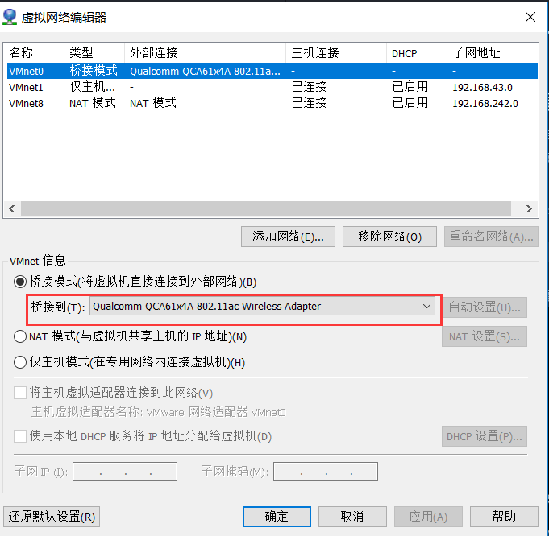
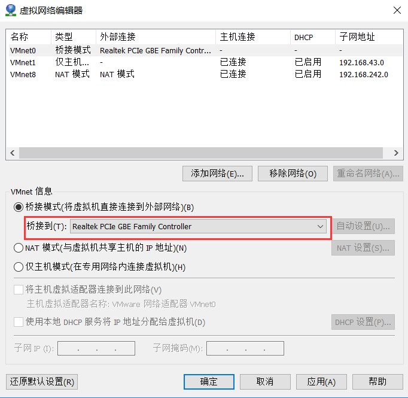
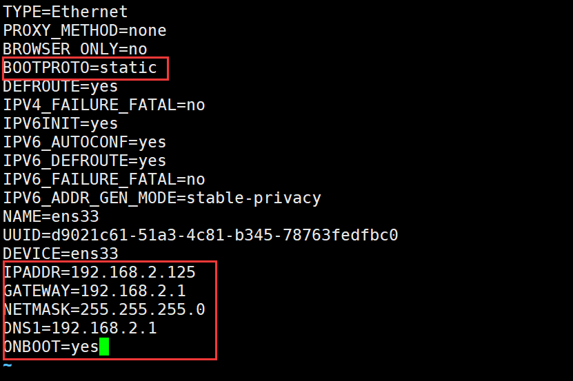
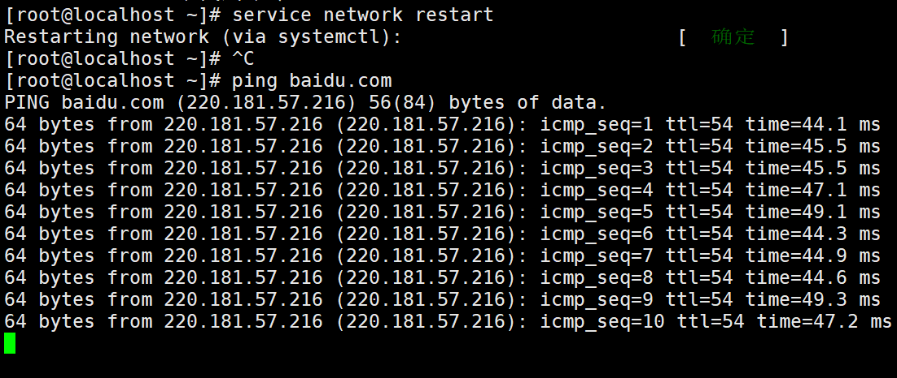

# 桥接模式下centos7 网络配置

> 安装环境说明：
>
> vmware版本：VMware® Workstation 14 Pro <br>
>  centos版本：CentOS-7-x86_64-Minimal-1810

## 详细的配置步骤如下：

### 0. vmware 虚拟网络编辑器的配置
打开vmware的“编辑”-->"虚拟网络编辑器"，点击“更改配置”获取管理员权限，选中“VMnet0”，  
如果主机是用WIFI联网的，则桥接到如下图选择：


如果主机是用有线网卡联网的，则桥接到如下图选择：


### 1.配置静态ip，输入如下命令：
`vi /etc/sysconfig/network-scripts/ifcfg-ens33`

配置ip、网关、NETMASK、DNS，截图如下

>说明：  
     1、上图红色方框都是要修改的地方；  
     2、网关、DNS要跟主机的一样，这样才能连接外网，主机的网关和DNS可以在主机命令行窗口下输入 ipconfig -all 查看

### 2. 重启网络配置
输入如下命令，两个命令都行  
`systemctl restart network.service`  
或者  
`service network restart`

最后ping一下外网，截图如下：  


### 3.安装必要的工具软件
更新系统并安装必备的组件
```
yum upgrade or yum update
yum install wget telnet perl perl-devel net-tools kernel-devel
yum groupinstall "Development tools" -y
```
安装这些之后会大大方便今后安装其他应用是碰到的依赖包问题。其中net-tools是为了提供dig, nslookup, ipconfig等命令，方便配置CentOS 7初始化网络环境。如果不安装这个，在CentOS 7中，可以使用ip addr命令来代替ipconfig进行当前ip地址查询。
