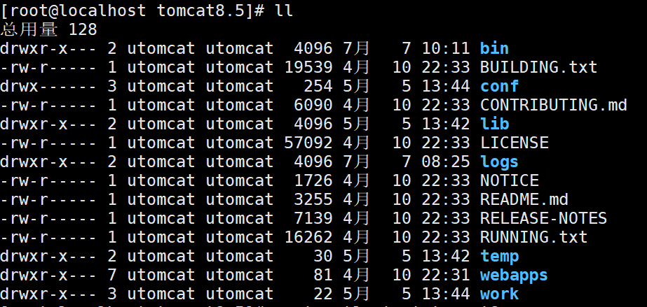

# centos 下tomcat 指定用户启动

## 1、新建一个用于运行tomcat的用户: utomcat
```
#useradd -s /usr/sbin/nologin utomcat

```
> 说明：-s /usr/sbin/nologin 禁止该用户登录
> 也可以在用户创建之后执行：
> usermod -s | --shell /usr/sbin/nologin username

## 2、将tomcat的安装目录的所有者换成 utomcat
```
# chown -R utomcat:utomcat tomcat8.5

```
修改后tomcat的目录截图如下：


## 3、配置Tomcat的运行环境
到tomcat的bin 目录下，新建配置文件setenv.sh, 内容如下：

```
[root@localhost bin]# vi setenv.sh
#add cardtomcat pid
CATALINA_PID="$CATALINA_BASE/tomcat8.pid"
#add java opts
JAVA_OPTS="-server -XX:PermSize=256M -XX:MaxPermSize=1024m -Xms512M -Xmx1024M -XX:MaxNewSize=256m"

```
>重要说明：
CATALINA_PID="$CATALINA_BASE/tomcat8.pid"  
tomcat8 这个名字必须和下面的service名字一样：  
tomcat8.service

## 4、在tomcat bin目录下 的catalina.sh 文件添加java 路径(在文件开头的位置)
```
------------------------------------
#   USE_NOHUP       (Optional) If set to the string true the start command will
#                   use nohup so that the Tomcat process will ignore any hangup
#                   signals. Default is "false" unless running on HP-UX in which
#                   case the default is "true"
# -----------------------------------------------------------------------------
export JAVA_HOME=/usr/java/jdk1.8.0_212
export JRE_HOME=/usr/java/jdk1.8.0_212/jre

# OS specific support.  $var _must_ be set to either true or false.

```

## 5、配置tomcat服务
```
[root@localhost bin]# vi /usr/lib/systemd/system/tomcat8.service

```
配置内容如下：
```
Unit]
Description=tomcat8
After=syslog.target network.target remote-fs.target nss-lookup.target

[Service]
User=utomcat
Group=utomcat
Type=forking
PIDFile=/usr/local/tomcat8.5/tomcat8.pid
ExecStart=/usr/local/tomcat8.5/bin/startup.sh
ExecReload=/bin/kill -s HUP $MAINPID
ExecStop=/bin/kill -s QUIT $MAINPID
PrivateTmp=true

[Install]
WantedBy=multi-user.target

```
>说明： User,Group 指的是你用哪个用户作为启动的用户

## 6、设置新服务生效
```
开启系统重启自动启动：
[root@localhost bin]# systemctl enable tomcat8
启动我们新的服务：
[root@localhost bin]# systemctl start tomcat8
查看启动状态：
[root@localhost bin]# systemctl status tomcat8

```

## 问题：如果启动出现如下问题，说明java 环境问题，根据第4点操作即可解决，
```
[root@localhost bin]# systemctl start tomcat8
Job for tomcat8.service failed because the control process exited with error code. See "systemctl status tomcat8.service" and "journalctl -xe" for details.
[root@localhost bin]# systemctl status tomcat8
● tomcat8.service - tomcat8
   Loaded: loaded (/usr/lib/systemd/system/tomcat8.service; enabled; vendor preset: disabled)
   Active: failed (Result: exit-code) since 日 2019-07-07 12:22:53 CST; 16s ago
  Process: 7232 ExecStop=/bin/kill -s QUIT $MAINPID (code=exited, status=0/SUCCESS)
  Process: 7261 ExecStart=/usr/local/tomcat8.5/bin/startup.sh (code=exited, status=1/FAILURE)
 Main PID: 7154 (code=exited, status=143)

7月 07 12:22:53 localhost.localdomain systemd[1]: Starting tomcat8...
7月 07 12:22:53 localhost.localdomain startup.sh[7261]: Neither the JAVA_HOME nor the JRE_HOME environment varia...ined
7月 07 12:22:53 localhost.localdomain startup.sh[7261]: At least one of these environment variable is needed to ...gram
7月 07 12:22:53 localhost.localdomain systemd[1]: tomcat8.service: control process exited, code=exited status=1
7月 07 12:22:53 localhost.localdomain systemd[1]: Failed to start tomcat8.
7月 07 12:22:53 localhost.localdomain systemd[1]: Unit tomcat8.service entered failed state.
7月 07 12:22:53 localhost.localdomain systemd[1]: tomcat8.service failed.
Hint: Some lines were ellipsized, use -l to show in full.

```
