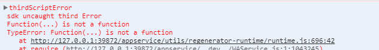
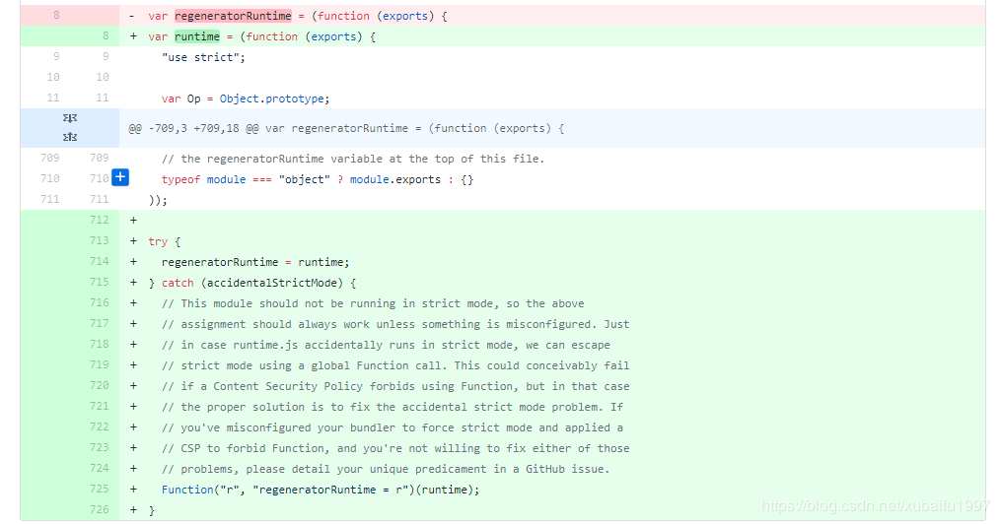

# 在小程序中使用 async await
>使用场景：  
在写大耳朵一乐的小程序中，每次打开小程序需要向服务端请求token有效验证：checkBigearsToken()，后面的所有操作都需要依赖 此token验证返回的结果，所以想到了ES7的async-await

** 问题：**  
到目前为止小程序还不支持ES7的语法，所以我们要引入regenerator 的regenerator-runtime

步骤如下：  
#### 1、到小程序项目所在的目录中，打开命令行窗口，初始化npm

```
npm init

```

#### 2、安装regenerator-runtime
```
npm install regenerator-runtime

```

#### 3、到小程序开发工具，构建npm
到小程序开发工具，点击"工具"-->"构建npm"

>注意：每次用npm 安装新的包后，需要到小程序开发工具 构建npm 才会生效

#### 4、使用async-await
- 在需要使用async的地方引入regenerator-runtime,比如在classic.js中引用

```
const regeneratorRuntime = require('regenerator-runtime')

```

- 使用async-await，示例代码如下：

```
onShow:async function () {
      if (!app.globalData.hasLogin && wx.getStorageSync('userInfo') && wx.getStorageSync('token')) {
        await userModel.checkBigearsToken().then((res)=>{
          app.globalData.hasLogin = true

        }).catch(()=>{
          app.globalData.hasLogin = false
        })
      }
      //后面的代码省略。。。
}

```
>说明：加了 await，onShow函数会一直阻塞中，直到checkBigearsToken()返回结果，才会继续后面的代码执行，这里checkBigearsToken()是个Promise

### 使用过程所遇到的问题
当引入regenerator-runtime的库后，会出现如下错误：

>说明：此时。我编辑器开启了ES6转ES5

**解决办法： **  
百度后，找到此篇文章：[小程序开启ES6转ES5后async函数无法使用的最新解决方案](https://blog.csdn.net/xubaifu1997/article/details/90605683)

大概意思是：  
Facebook在19年3月8号更新了runtime.js 的代码，用了 Function 函数，小程序当然是拒绝使用这个不安全的函数的，于是就报错了。  
解决办法：  
找到工程项目所在的文件夹下的node_modules\regenerator-runtime下的runtime.js文件  
**删掉新增的try-catch语句，同时将var runtime改回var regeneratorRuntime即可。**  
位置大概如下图:

