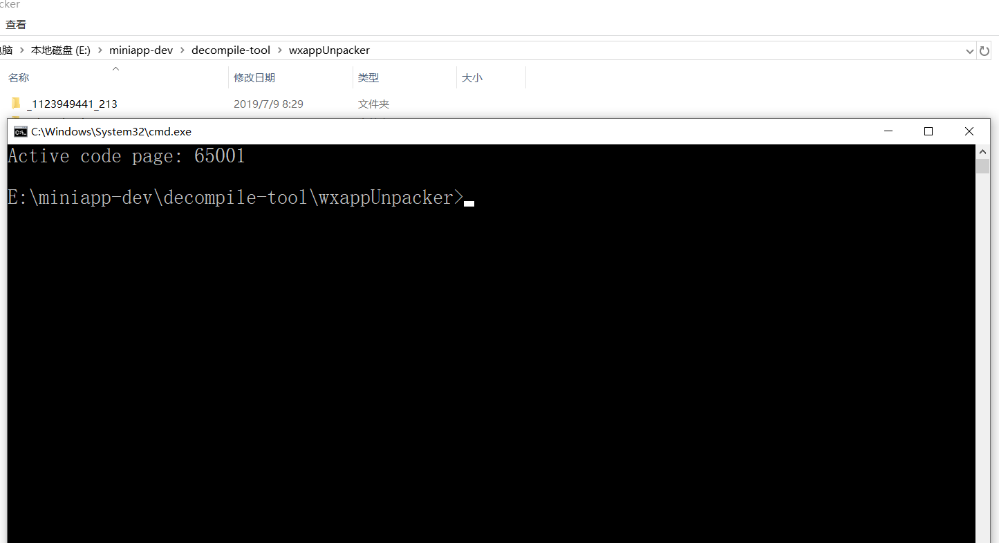
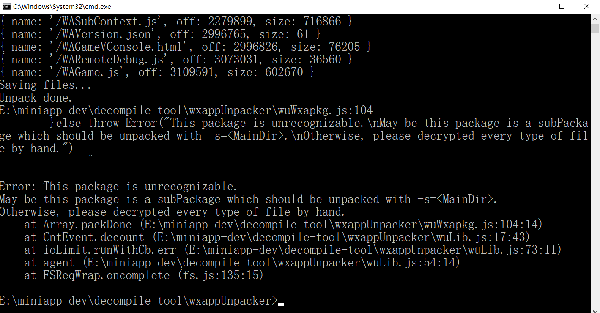

# 反编译微信小程序

首先要下载必要的工具，有的可以直接用了

```
1、下载wxappUnpacker，我这里用的是node版还有其他班自己查https://github.com/qwerty472123/wxappUnpacker
2、下载node。js；
3、安装夜神模拟器；

```
## 具体步骤如下：
### 一、找到小程序的缓存文件
###### 1、安装手机模拟器（这里我用的是夜神模拟器）
###### 2、在模拟器上安装 微信
###### 3、缓存小游戏或小程序
&ensp; &ensp; 打开微信 然后找到你想要获取代码的小游戏或小程序  打开这个小游戏或小程序，程序开始运行之后源文件就已经下载到本地了。
###### 4、找到源文件
&ensp; &ensp;打开夜神模拟器的文件管理，管理器里面找到之前说到的那个目录：

   /data/data/com.tencent.mm/MicroMsg/{{一串32位的16进制字符串名文件夹}}/appbrand/pkg/
通过 访问的时间 找到刚才运行的程序,勾选，然后，打开夜神模拟器的“文件助手”--"打开安卓文件夹"，点击右上角的三个点，选择粘贴选中

复制完如图：


然后打开夜神模拟器的“文件助手”--"打开电脑文件夹",就可找到刚打开的小程序的缓存文件：


### 一、反编译小程序的缓存文件

###### 1、确保安装好node .js 运行环境
###### 2、下载wxappUnpacker到本地，解压缩文件，进到文件下，打开命令行窗口：


然后安装以下依赖包 ：

npm install esprima

npm install css-tree

npm install cssbeautify

npm install vm2

npm install uglify-es

npm install js-beautify

在该项目内执行：

```
npm install esprima css-tree cssbeautify vm2 uglify-es js-beautify escodegen

```


这些都安装好之后 ，最后一步的反编译就来了  ：

继续在当前的命令行输入  

node wuWxapkg.js [-d] <files...>     //files 就是你想要反编译的文件名

## 异常
- 未识别的包

```
...
Saving files...
Unpack done.
/Users/whidy/webs/wxappUnpacker/wuWxapkg.js:104
        }else throw Error("This package is unrecognizable.\nMay be this package is a subPackage which should be unpacked with -s=<MainDir>.\nOtherwise, please decrypted every type of file by hand.")
              ^

Error: This package is unrecognizable.
May be this package is a subPackage which should be unpacked with -s=<MainDir>.
Otherwise, please decrypted every type of file by hand.
    at Array.packDone (/Users/whidy/webs/wxappUnpacker/wuWxapkg.js:104:14)
    at CntEvent.decount (/Users/whidy/webs/wxappUnpacker/wuLib.js:17:43)
    at ioLimit.runWithCb.err (/Users/whidy/webs/wxappUnpacker/wuLib.js:73:11)
    at agent (/Users/whidy/webs/wxappUnpacker/wuLib.js:54:14)
    at FSReqWrap.oncomplete (fs.js:141:20)

```



以下是网上搜索的解决办法：  
原因是未定义的$gwx，这个就要修改一下工具源码了，打开<font color=#FF0000 >wuWxss.js</font>文件，修改内容如下：

```
// 原始
function runVM(name,code){
    let wxAppCode={},handle={cssFile:name};
    let vm=new VM({sandbox:Object.assign(new GwxCfg(),{__wxAppCode__:wxAppCode,setCssToHead:cssRebuild.bind(handle)})});
    vm.run(code);
    for(let name in wxAppCode)if(name.endsWith(".wxss")){
        handle.cssFile=path.resolve(frameName,"..",name);
        wxAppCode[name]();
    }
}
```

改成新的：
````
function runVM(name,code){
    let wxAppCode={},handle={cssFile:name};
    let gg = new GwxCfg();
    let tsandbox ={$gwx:GwxCfg.prototype["$gwx"],__mainPageFrameReady__:GwxCfg.prototype["$gwx"],__wxAppCode__:wxAppCode,setCssToHead:cssRebuild.bind(handle)};
    let vm = new VM({sandbox:tsandbox});
    vm.run(code);
    for(let name in wxAppCode)if(name.endsWith(".wxss")){
        handle.cssFile=path.resolve(frameName,"..",name);
        wxAppCode[name]();
    }
}
````
网上的解决方法似乎没有作用，后来发现，缓存文件有两个，要反编译比较小的那个文件才能成功，这应该是程序的入口，这里反编译的是_2091050133_33.wxapkg 这个文件。


###  &ensp; &ensp;成功编译！

