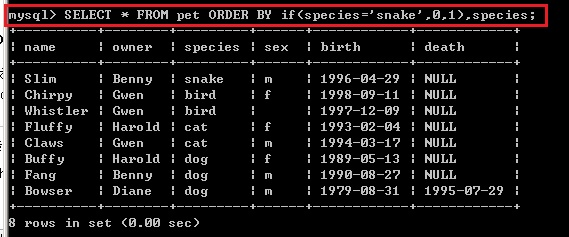
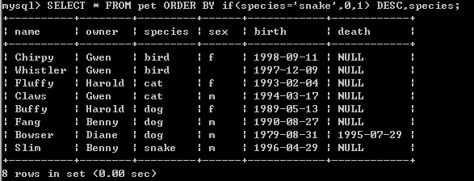
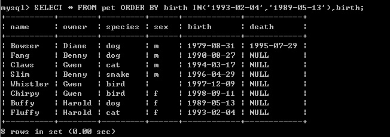

# 关于mysql中 order by的记录

> 场景需求描述：  
> 在大耳朵一乐中有一个收藏功能，在个人中心可以看到收藏列表，收藏列表的排序需求：  
> - 把当天收藏的内容排在最前面  
> - 把非当天收藏的内容按点击量 逆序排序

查了baidu ，找到解决办法，如下：  
** 使用ORDER BY配合IF语句 **  
比如我想将species为snake的行数，单独列出来，我可以这样查询

SELECT * FROM pet ORDER BY if (species='snake',0,1),species;

结果如下  


我们可以看到，species为snake的行数，被强行放置到了查询结果开头

这是怎么做到的呢？

这里需要注意：

if (species='snake',0,1),species;

这句话的意思是，我对species进行排序的同时，给species附加一个隐藏属性，这个隐藏属性，可以是0或者1

什么意思呢？就是在对species排序的时候，优先级是判断species是否为snake，如果是，返回0，如果不是，返回1.

随后，先进行species隐藏属性的排序，隐藏属性拍完以后，再进行剩余species的排序

也就是说，你可以把这个 if 语句，看成是一个独立的column


那如果我们想把snake的这一行放在查询结果尾部呢？

那你可以这样写  SELECT * FROM pet ORDER BY if(species='snake',0,1) DESC,species;


正如上面一段说的，你可以把if 语句看成是独立的column，<font color=red size=4 face="黑体">所以你也可以为他添加排序条件ASC或者DESC</font>，当然默认是ASC，可以不写。

这样，查询就等于第一步是查询隐藏属性0,1，然后进行DESC排序，因为species=snake的返回值是0，所以进行倒序排列时，就被排在了最后


以此类推，你在进行隐藏属性优先排序的同时，对于剩下的排序，你也可以另外进行ASC或者DESC的排序，就不截图了。

**使用ORDER BY配合IN语句**  
上面一个是满足单个条件，返回0或者1，那如果需要用到一个范围呢？你可以使用IN语句

比如下面,我要求把出生日期为1993-02-04或者1989-05-13的行数，排在最后

SELECT * FROM pet ORDER BY birth IN('1993-02-04','1989-05-13'),birth;



这样的话，birth IN语句会进行判断，如果birth满足条件，返回1，不满足，返回0

所以，满足条件的两行，因为返回值是1，进行ASC排序的时候，就被放置在了最后。

### 最后给出项目需求的sql语句
```
select view_counts,create_time,cl.* from classic cl
        left join user_like_classic ulc on ulc.classic_id = cl.id
        where
        cl.status=1
        and ulc.user_id  = '99999' order by if(substring(create_time,1,10)=curdate(),0,1),substring(create_time,1,7) DESC,view_counts DESC

#if(substring(pubtime,1,10)=curdate(),0,1),if(substring(pubtime,1,10)=SUBDATE(curdate(), INTERVAL 5 DAY),0,1)
# if(datediff(curdate(),substring(pubtime,1,10))<=2,0,1) asc

```
