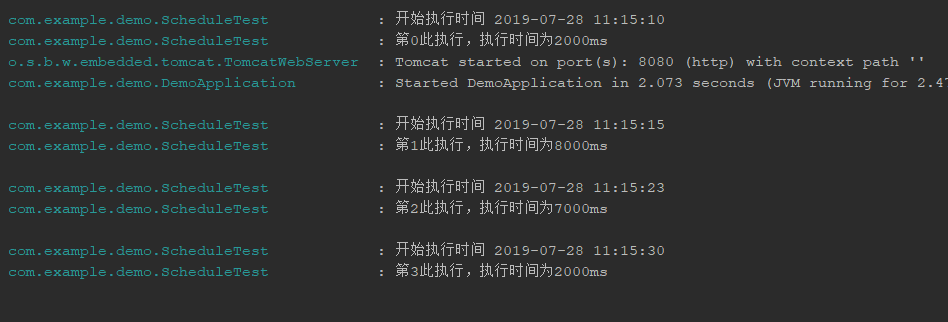

# SpringBoot scheduling定时器

>本文转载自 [SpringBoot定时器](https://blog.csdn.net/weixin_41131531/article/details/90080991)

Spring Boot需要开启定时器注解@EnableScheduling
```
@EnableScheduling
@SpringBootApplication
public class Application {
    public static void main(String[] args) {
        SpringApplication.run(Application.class, args);
    }

}

```

Spring定时器分为三种模式，分别是fixedDelay、cron、fixedRate
- fixedDelay：此方式为在执行完成一次后间隔多少毫秒后再执行下一次

```
private List<Integer> index = Arrays.asList(5000,3000,2000);

    private AtomicInteger atomicInteger = new AtomicInteger(0);

	//此处为间隔一秒
    @Scheduled(fixedDelay = 1 * 1000)
    public void fixedDelay() throws InterruptedException {
        int i = atomicInteger.get();
        if (i < 3) {
            log.info("第{}此执行，执行时间为{}ms", i, index.get(i));
            Thread.sleep(index.get(i));
            atomicInteger.getAndIncrement();
        }
    }

```
- cron：设定执行时间，如到达下个任务的执行时间点时，如上个任务还未执行完，需等下一个执行时间点，如果还是有任务在执行，那么会继续等待至下个时间点

cron配置规格例：  
0 0 10,14,16 * * ? 每天上午10点，下午2点，4点  
0 0/30 9-17 * * ? 朝九晚五工作时间内每半小时  
0 0 12 ? * WED 表示每个星期三中午12点  
0 0 12 * * ? 每天中午12点触发  
0 15 10 ? * * 每天上午10:15触发  
0 15 10 * * ? 每天上午10:15触发  
0 15 10 * * ? * 每天上午10:15触发  
0 15 10 * * ? 2005 2005年的每天上午10:15触发  
0 * 14 * * ? 在每天下午2点到下午2:59期间的每1分钟触发  
0 0/5 14 * * ? 在每天下午2点到下午2:55期间的每5分钟触发  
0 0/5 14,18 * * ? 在每天下午2点到2:55期间和下午6点到6:55期间的每5分钟触发  
0 0-5 14 * * ? 在每天下午2点到下午2:05期间的每1分钟触发  
0 10,44 14 ? 3 WED 每年三月的星期三的下午2:10和2:44触发  
0 15 10 ? * MON-FRI 周一至周五的上午10:15触发  
0 15 10 15 * ? 每月15日上午10:15触发  
0 15 10 L * ? 每月最后一日的上午10:15触发  
0 15 10 ? * 6L 每月的最后一个星期五上午10:15触发  
0 15 10 ? * 6L 2002-2005 2002年至2005年的每月的最后一个星期五上午10:15触发  
0 15 10 ? * 6#3 每月的第三个星期五上午10:15触发  

```
private List<Integer> index = Arrays.asList(8000,6000,7000);

    private AtomicInteger atomicInteger = new AtomicInteger(0);
	/**
     * 此处设定的是0,5,15,25...秒时执行
     *
     * @throws InterruptedException
     */
    @Scheduled(cron = "0/5 * * * * ?")
    public void cron() throws InterruptedException {
        int i = atomicInteger.get();
        if (i < 3) {
            log.info("开始执行时间 {}", System.currentTimeMillis());
            log.info("第{}此执行，执行时间为{}ms", i, index.get(i));
            Thread.sleep(index.get(i));
            atomicInteger.getAndIncrement();
        }
    }

```
- fixedRate：已开启任务开始时间开始计算每次任务执行的时间点，如果下一次任务的执行点超出的约定的时间点，则会立即执行任务，如果还未到达约定的时间点，那么则会等待至时间点执行，约定时间的计算规则为任务的开始时间+(第几次任务-1)*设定的时间间隔

```
import java.util.Date;
import java.util.List;
import java.util.concurrent.atomic.AtomicInteger;

/**
 * Author: gallop
 * E-Mail: 39100782@qq.com
 * Description:
 * Date: Create in 11:07 2019/7/28
 * Modified By:
 */
@Component
public class ScheduleTest {
    private Logger logger = LoggerFactory.getLogger(this.getClass());
    private List<Integer> index = Arrays.asList(2000,8000,7000,2000);

    private AtomicInteger atomicInteger = new AtomicInteger(0);

    SimpleDateFormat simpleDateFormat = new SimpleDateFormat("yyyy-MM-dd HH:mm:ss");
    @Scheduled(fixedRate = 5*1000)
    public void fixedRate() throws InterruptedException {
        int i = atomicInteger.get();
        System.out.println("i="+i);
        if (i < 4) {
            logger.info("开始执行时间 {}", simpleDateFormat.format(new Date(System.currentTimeMillis())));
            logger.info("第{}此执行，执行时间为{}ms", i, index.get(i));
            Thread.sleep(index.get(i));
            atomicInteger.getAndIncrement();
        }
    }
}
```
执行结果：demo定义每隔5秒执行一次，开始时间为2019-07-28 11:15:10，此次任务跑完的时间大约为2019-07-28 11:15:12，由于还未到达间隔5秒的约定时间，所以第二次任务会等待至2019-07-28 11:15:15执行，而第三次执行的约定时间为2019-07-28 11:15:20，但是第二次执行完成的时间约为2019-07-28 11:15:23，已经超出了约定时间，所以立即执行第三次任务


