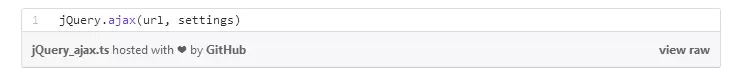
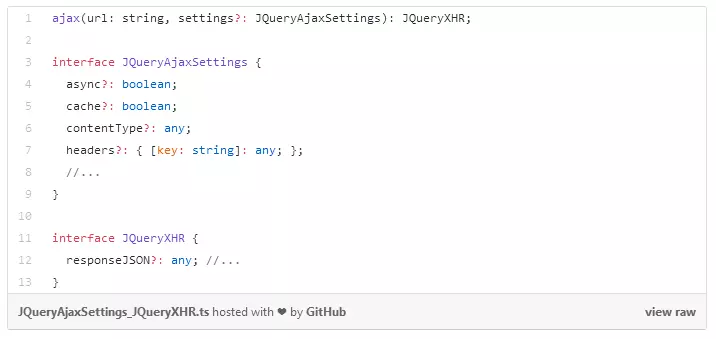

# vue 中的ts文件是什么

>此文章摘自 [如何在vue中植入ts文件](https://www.jianshu.com/p/a57431ea0f6b)  
>[vuejs中 TypeScript 支持-官网](https://cn.vuejs.org/v2/guide/typescript.html)

** ts有什么用？**
>类型检查、直接编译到原生js、引入新的语法糖

**为什么用ts？**
>TypeScript的设计目的应该是解决JavaScript的“痛点”：弱类型和没有命名空间，导致很难模块化，不适合开发大型程序。另外它还提供了一些语法糖来帮助大家更方便地实践面向对象的编程。
typescript不仅可以约束我们的编码习惯，还能起到注释的作用，当我们看到一函数后我们立马就能知道这个函数的用法，需要传什么值，返回值是什么类型一目了然，对大型项目的维护性有很大的提升。也不至于使开发者搬起石头砸自己的脚。

**Angular: 我们为什么选择TypeScript?**
- TypeScript 里优秀的工具  
- TypeScript 是 JavaScript 的超集
- TypeScript 使得抽象清晰可见
- TypeScript 使代码更容易阅读和理解

是的，我知道这看起来并不直观。让我用一个例子来说明我的意思。让我们来看看这个函数jQuery.ajax()。我们能从它的签名中得到什么信息?


我们唯一能确定的是这个函数有两个参数。我们可以猜测这些类型。也许第一个是字符串，第二个是配置对象。但这只是猜测，我们可能错了。我们不知道什么选项进入设置对象(它们的名称和类型)，或者该函数返回什么。
在不检查源代码或文档的情况下，我们不可能调用这个函数。检查源代码并不是一个好的选择——拥有函数和类的目的，是在不知道如何实现它们的情况下使用它们。换句话说，我们应该依赖于他们的接口，而不是他们的实现。我们可以检查文档，但这并不是最好的开发经验——它需要额外的时间，而且文档经常过期。
因此，尽管很容易阅读jQuery.ajax(url,settings)，真正理解如何调用这个函数，我们需要阅读它的实现或它的文档。
以下是一个类型版本：


它给了我们更多的信息。
- 这个函数的第一个参数是一个字符串。
- 设置参数是可选的。我们可以看到所有可以传递到函数中的选项，不仅是它们的名称，还包括它们的类型。
- 函数返回一个JQueryXHR对象，我们可以看到它的属性和函数。

类型化签名肯定比未类型化的签名长，但是:string，:JQueryAjaxSettings和JQueryXHR并不是混乱的。  
它们是提高代码的可理解性的重要文档。我们可以更深入地理解代码，而不必深入到实现或读取文档中。  
我的个人经验是，我可以更快地阅读类型化代码，因为类型提供了更多的上下文来理解代码。
**ts好学吗？**
>TypeScript的一个设计亮点就是它并没有抛弃JavaScript的语法另起炉灶，而是做成了JavaScript的超集（这个功劳应该记在Anders上），这样任何合法的JavaScript的语句在TypeScript下都是合法的，也就是说学习成本很低，如果你对JavaScript有比较深入的了解，那么其实可以很快的上手TypeScript，因为它的设计都是针对JavaScript的使用习惯和惯例。

一些简单的例子，一看即懂：
基础类型：
```
let isDone: boolean = false;  // 布尔值
let decLiteral: number = 6;    // 数字
let name: string = "bob";  // 字符串
let list: number[] = [1, 2, 3]; // 数组
...
...

```

接口：
```
function printLabel(labelledObj: { label: string }) {
  console.log(labelledObj.label);
}

let myObj = { size: 10, label: "Size 10 Object" };
printLabel(myObj);

```

型检查器会查看printLabel的调用。 printLabel有一个参数，并要求这个对象参数有一个名为label类型为string的属性。 需要注意的是，我们传入的对象参数实际上会包含很多属性，但是编译器只会检查那些必需的属性是否存在，并且其类型是否匹配。
当然还有一些高级的用法，这里就不做过多的介绍了，[了解更多](https://www.tslang.cn/docs/handbook/basic-types.html)
