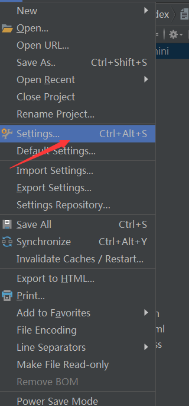
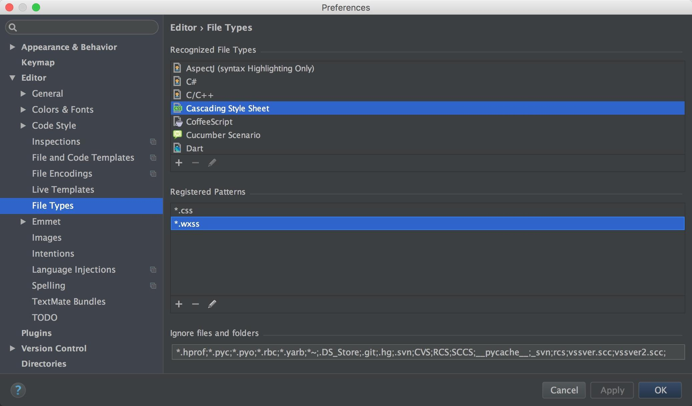
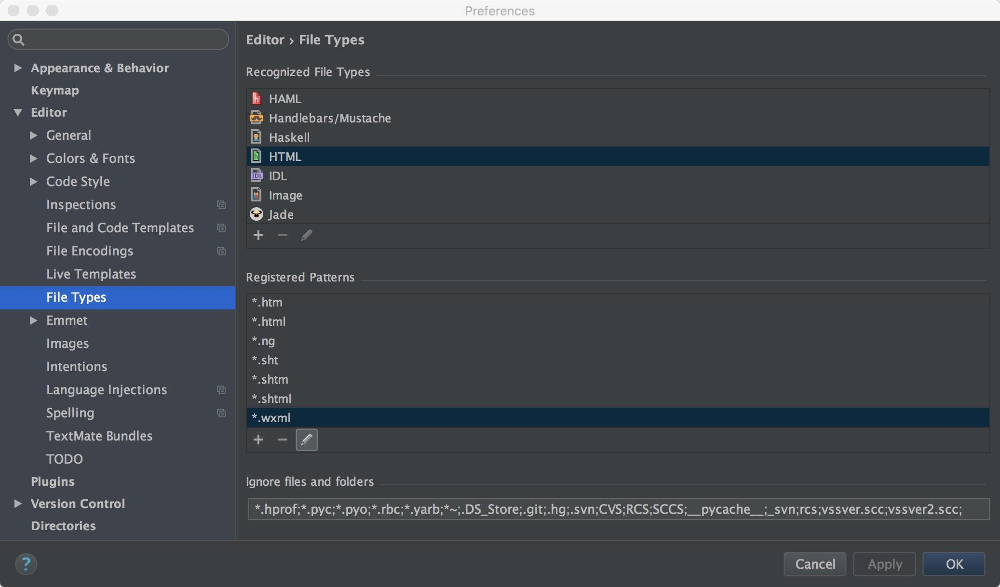

# webstorm开发微信小程序设置

## 0.设置识别.wxss文件
File---settings点击出来以下页面  

  

选择FileType下Cascading Style Sheet 添加*.wxs  

  

## 1.设置识别.wxml文件
FileType下HTML 添加*.wxml  

## 1.添加微信接口代码提示插件  

将其中的[wecharCode.ja](https://github.com/miaozhang9/wecharCodejar)下载下来，解压出jar 文件，然后在webStorm 的 File -> import settings 中导入即可
